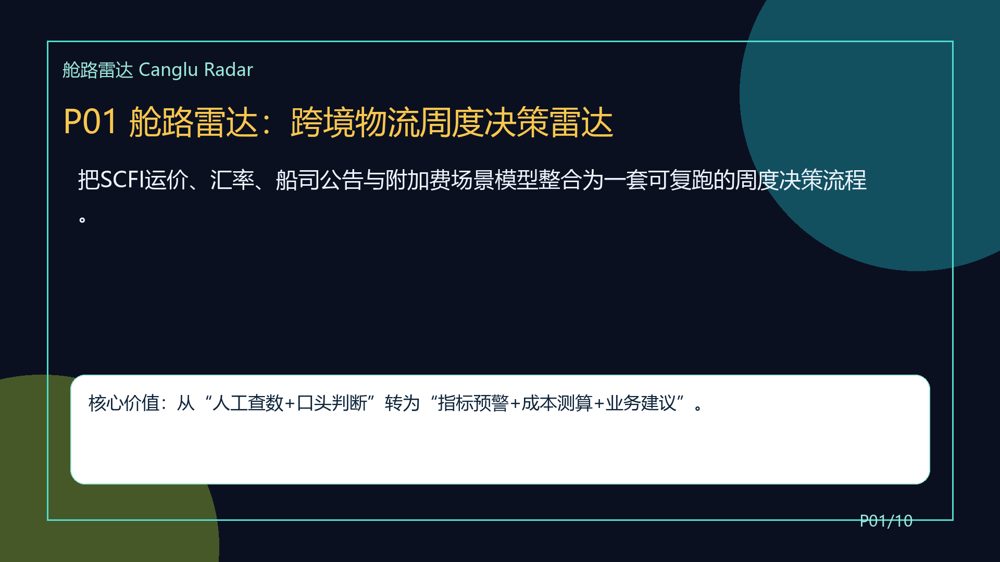
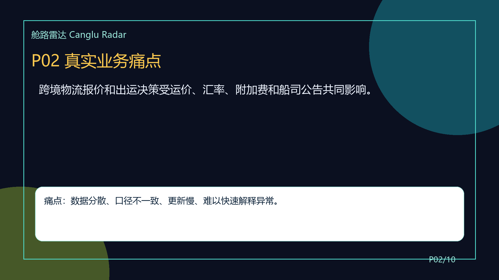
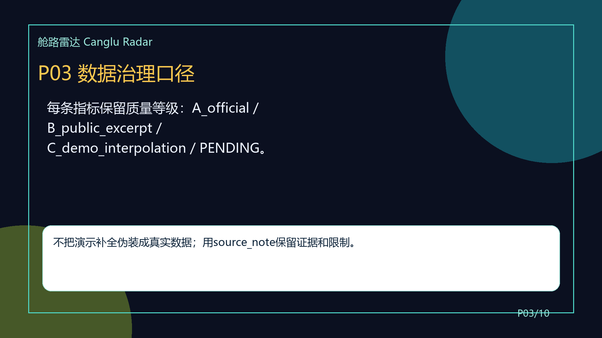
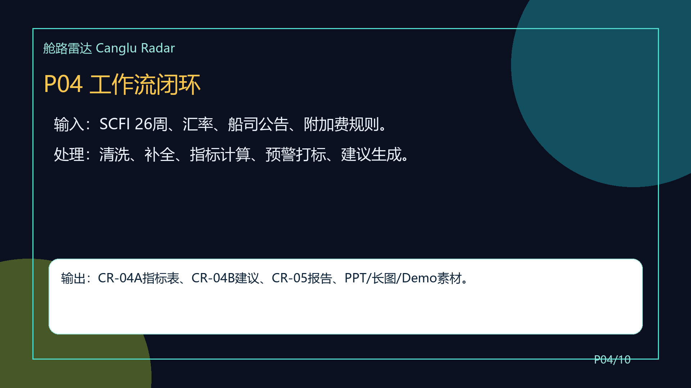
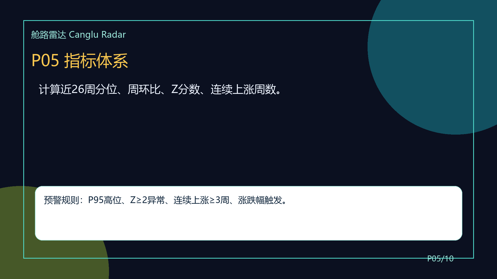
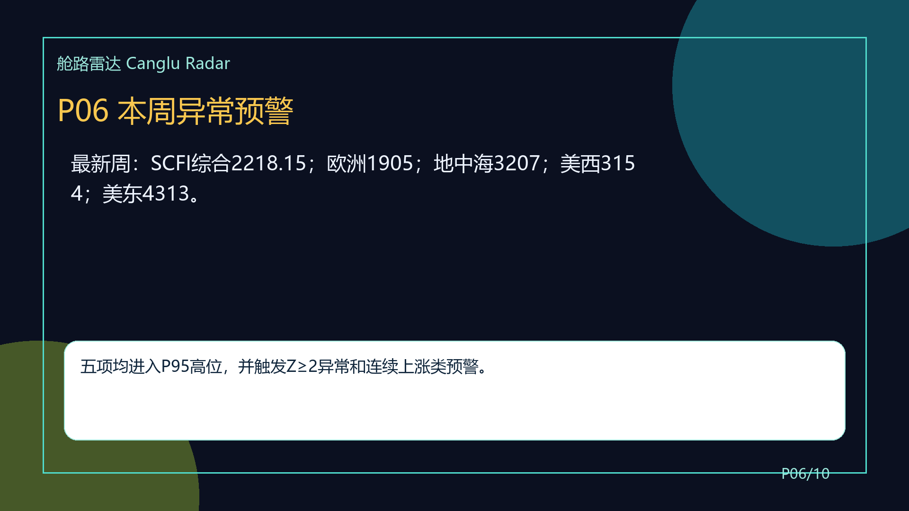
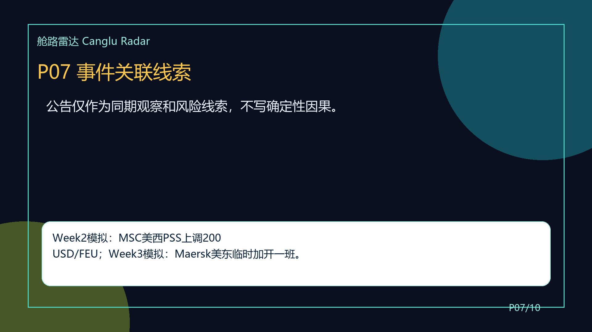
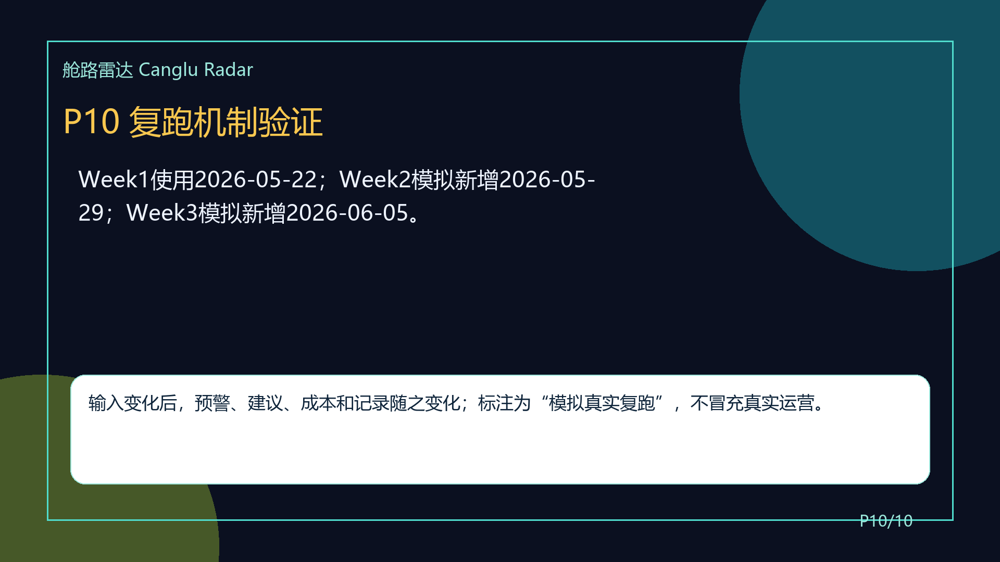

# CR-06｜可打印PPT稿

> 说明：本文件为正式PPTX导出受环境限制时的可打印替代稿；同目录 screenshots/ 提供逐页PNG截图。

## P01 P01 舱路雷达：跨境物流周度决策雷达

把SCFI运价、汇率、船司公告与附加费场景模型整合为一套可复跑的周度决策流程。

**页脚说明：** 核心价值：从“人工查数+口头判断”转为“指标预警+成本测算+业务建议”。

## P02 P02 真实业务痛点

跨境物流报价和出运决策受运价、汇率、附加费和船司公告共同影响。

**页脚说明：** 痛点：数据分散、口径不一致、更新慢、难以快速解释异常。

## P03 P03 数据治理口径

每条指标保留质量等级：A_official / B_public_excerpt / C_demo_interpolation / PENDING。

**页脚说明：** 不把演示补全伪装成真实数据；用source_note保留证据和限制。

## P04 P04 工作流闭环

输入：SCFI 26周、汇率、船司公告、附加费规则。  
处理：清洗、补全、指标计算、预警打标、建议生成。

**页脚说明：** 输出：CR-04A指标表、CR-04B建议、CR-05报告、PPT/长图/Demo素材。

## P05 P05 指标体系

计算近26周分位、周环比、Z分数、连续上涨周数。

**页脚说明：** 预警规则：P95高位、Z≥2异常、连续上涨≥3周、涨跌幅触发。

## P06 P06 本周异常预警

最新周：SCFI综合2218.15；欧洲1905；地中海3207；美西3154；美东4313。

**页脚说明：** 五项均进入P95高位，并触发Z≥2异常和连续上涨类预警。

## P07 P07 事件关联线索

公告仅作为同期观察和风险线索，不写确定性因果。

**页脚说明：** Week2模拟：MSC美西PSS上调200 USD/FEU；Week3模拟：Maersk美东临时加开一班。

## P08 P08 场景化成本测算

附加费不再简单求和，改为场景模型。

**页脚说明：** Base：836.50 USD/FEU；Stress：2111.50 USD/FEU；USEC Panama Stress：2386.50 USD/FEU。

## P09 P09 差异化业务建议

欧洲：非急单推迟1-2周，急单锁价。  
地中海：关注替代港口或中转。  
美西：提前订舱，报价有效期缩短至7天。

**页脚说明：** 美东：关注巴拿马路径与分批方案。
综合指数：全航线收紧报价有效期。

## P10 P10 复跑机制验证

Week1使用2026-05-22；Week2模拟新增2026-05-29；Week3模拟新增2026-06-05。

**页脚说明：** 输入变化后，预警、建议、成本和记录随之变化；标注为“模拟真实复跑”，不冒充真实运营。

