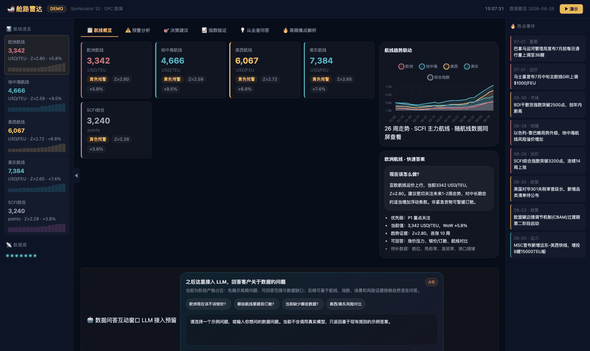
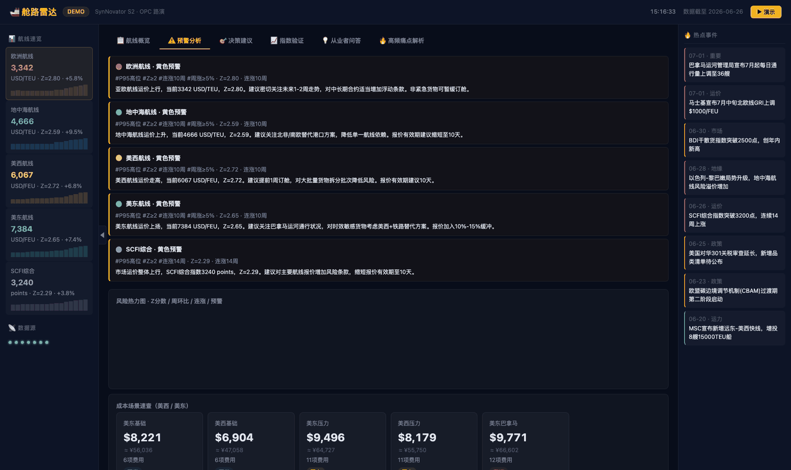
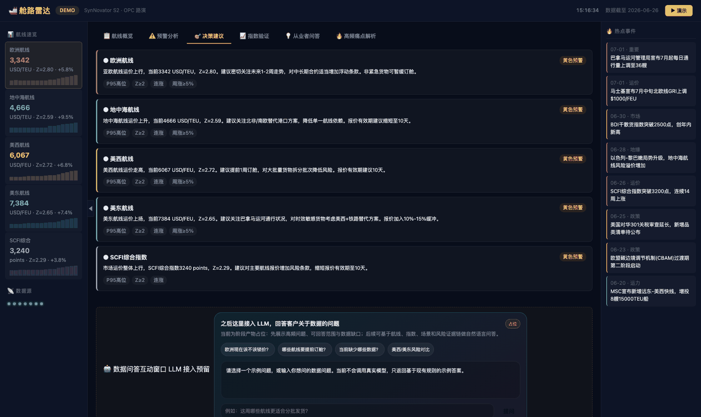

# 舱路雷达 canglu-radar

[](https://github.com/along0013/canglu-radar/actions/workflows/smoke.yml)

面向跨境物流与供应链的**发货决策支持系统**。把分散的运价指数、汇率、油价、船公司公告与附加费规则，
统一加工成一份可直接用于每周发货决策的数据包，并输出航线级异常预警与建议动作。



---

## 1. 要解决的问题

跨境物流运营每周要做一次发货决策——美西 / 美东 / 欧洲三条航线**是否发货、是否锁价**。
但这个判断原本要从 5–6 个来源人工汇总：

```text
数据源1 → 数据源2 → 数据源3 → PDF公告 → 汇率/附加费 → Excel测算 → PPT周报
```

CR-01 阶段归纳出的四个稳定瓶颈：

| 痛点 | 现象 | 频次 |
|:--|:--|:--|
| 多源分散 | 指数来源各自发布，口径与周期不一致 | 每周 |
| 公告易遗漏 | GRI / PSS / BAF / 停航公告分散且不定期 | 每周 · 不定期 |
| 成本测算滞后 | 附加费规则靠手算，场景一变就要重做 | 每周 |
| 经验依赖强 | 结论强依赖个人经验，新人无法独立给出判断 | 高频 |

**设计目标**：把从原始数据到可决策结论的初稿生成，从 3–4 小时压缩到 10–20 分钟。

## 2. 交付形态

### output 五件套

系统的最终交付物不是页面，而是一份结构化数据包。这五个文件是 Dashboard 与后续分析的**核心数据契约**：

| 文件 | 作用 |
|:--|:--|
| `output/metrics.json` | 航线核心指标、最新值、趋势、预警等级、建议动作 |
| `output/history.json` | 运价、指数、汇率等历史序列 |
| `output/scenarios.json` | 附加费和压力场景测算 |
| `output/decisions.json` | 发货建议、风险解释、交叉验证摘要 |
| `output/indices.json` | 外部指数对比和质量等级 |

### Dashboard

`dashboard/demo-v3.html` 消费上述数据契约，分六个视图呈现。

**预警分析** —— 航线级预警卡片，标注 P95 分位、Z-score、连涨周数与周涨幅，并给出对应动作：



**决策建议** —— 把指标翻译成「现在该怎么做」：



## 3. 预警逻辑与设计取舍

这是项目的核心，也是判断最集中的地方。全部阈值集中在 `engine/config.yaml` 统一管理：

| 设计 | 取值 | 为什么这么定 |
|:--|:--|:--|
| 双通道 Z-score | 通道 A `2.0` / 通道 B `1.8` | 长期高位横盘会把标准差「撑大」，单靠 2.0 会**漏报**；用 1.8 作为趋势钝化的缓解通道 |
| 黄色预警 | `1.5` | 提前一档提示，留出决策时间 |
| 连涨周数 | `≥3` 周 | 捕捉「单周涨幅不大但持续上行」的行情 |
| 单周暴涨快通道 | 美西 `20%` / 美东 `18%` / 其余 `15%` | 统计指标天生滞后于突发事件（停航、跳港、地缘）；单周极端涨幅**直接跳红**，不等统计窗口 |
| 数据质量分级 | 样本 `≥22` → full；`≥16` → reduced；`<16` → insufficient | 样本不足时**不出结论**，而不是硬报一个不可靠的预警 |
| 季节性回退 | L1 比率阈值 → L2 月份回退表 | 3–6 月无明确航运淡旺季，用月份表兜底，避免季节性判断失灵时整条链路中断 |

其余参数：26 周滚动窗口、百分位 `[50, 75, 85, 90, 95]`、5 条航线（欧洲 / 地中海 / 美西 / 美东 / SCFI 综合）。

## 4. 架构

```text
shared CSV 输入
  → engine/compute.py      复算 output 五件套
  → engine/validate.py     校验 output 五件套契约
  → tests/*                输出契约 / 可复现性 / 数值 diff / Dashboard 字段契约
  → dashboard/demo-v3.html 消费 output 五件套
```

```text
engine/
  compute.py               # 从 shared 输入计算 output 五件套
  data_loader.py           # 数据加载工具
  metrics.py               # 指标辅助逻辑
  validate.py              # output 数据包校验
  config.yaml              # 航线 / 阈值 / 质量分级 / 季节性配置
dashboard/
  demo-v3.html             # Dashboard 页面（六个视图）
output/                    # 当前正式五件套数据包
tests/
  fixtures/shared/         # CI 可用的 shared 输入 fixture
  run_smoke_tests.py       # 统一 smoke 入口
scripts/smoke.sh           # 本地一键验证脚本
.github/workflows/         # GitHub Actions CI 配置
plans/                     # 审计、测试落地与治理文档
specs/                     # 数据格式与 UX 规格
archive/                   # 历史材料与数据治理记录
```

## 5. 工程化验证

### 统一验证入口

```bash
pip install -r requirements.txt   # 依赖：pyyaml
python tests/run_smoke_tests.py
```

通过时应看到：

```text
engine CLI path regression tests passed
validate path regression tests passed
output package smoke tests passed
compute reproducibility smoke test passed
compute output numeric diff smoke test passed
dashboard field contract tests passed
all P0/P1 smoke tests passed
```

覆盖的六组断言：

1. **engine CLI 路径回归** —— 相对 / 绝对 / 缺失路径的 fallback 行为
2. **validate 路径回归** —— `--data-dir` 能从项目根正确解析
3. **output 五件套契约** —— 五件套存在、JSON 可解析、`_meta` 字段跨文件一致、航线集合一致
4. **compute 可复现性** —— 从 fixture 复算五件套，写入**临时目录**，不覆盖正式 `output/`
5. **数值容差 diff** —— 复算结果与正式 `output/` 做核心字段比对（浮点用容差，生成时间类字段跳过）
6. **Dashboard 字段契约** —— 页面实际消费的简写字段能稳定映射到五件套正式字段

第 4、5 组是这套测试里最值得说的部分：**校验的不是「能不能跑」，而是「跑出来的东西和已交付的一致」**。
正式数据更新时需要同步刷新 `tests/fixtures/shared`，否则数值 diff 会（正确地）失败。

### CI

`.github/workflows/smoke.yml` 在 push 到 `main` / `master` 或提交 PR 时执行同一套测试，
状态见顶部 badge 与 Actions 页。

### 审计闭环

`plans/final-audit-report.md` 记录了阶段性审计结论：P0 五项闭环、P1 三项剩余风险、P2 三项治理建议。

其中两条建议已在后续完成：

| 审计建议 | 落地位置 |
|:--|:--|
| P1-2 增加复算输出与正式 output 的字段级 / 数值容差 diff | `tests/test_compute_output_diff.py` |
| P2-1 将统一验证入口接入 CI | `.github/workflows/smoke.yml` |

审计报告记录的是 5 组测试输出，当前 smoke 入口为 6 组——**报告滞后于代码，是项目持续推进的直接证据**。

### 数据治理

`archive/00-control/data-governance/` 保留了数据侧的口径规则：自然周与发布周的对齐规则、
多源数据治理、船公司公告的自然周归类、图表衍生指数规则。这类规则不写下来，
下次换人接手时必然重新踩一遍。

## 6. 本地运行

### 计算与校验

```bash
# 重新计算数据包（不覆盖正式 output）
python engine/compute.py --shared-dir tests/fixtures/shared --output-dir /tmp/canglu-output

# 校验某个 output 目录
python engine/validate.py --data-dir output
```

### 数据输入与 fixture

默认 CI / smoke tests 使用项目内 fixture `tests/fixtures/shared`，因此远端 checkout 后即可运行，
不依赖机器本地存在 `../shared`。

本地如需使用完整真实输入，可通过环境变量覆盖：

```bash
CANGLU_SHARED_DIR=../shared ./scripts/smoke.sh
```

fixture 覆盖当前计算链路需要的数据源：SCFI / CCFI / WCI / FBX / SCFIS、BDI / Brent、
USD-CNY 汇率、shipping events、surcharge scenarios、index comparison。

### Dashboard

直接用浏览器打开 `dashboard/demo-v3.html`。

已覆盖展示端短字段与正式字段的映射：

| Dashboard | output |
|:--|:--|
| `val` | `current_value` / `value` |
| `z` | `z_score` |
| `wow` | `wow_change_pct` |
| `streak` | `up_streak_weeks` |
| `level` | `warning_level` |
| `advice` | `suggestion` |
| `ql` | `quality_level` |

## 7. 已知边界

- Dashboard smoke tests 当前覆盖**字段契约**，不覆盖真实浏览器渲染、截图和交互。
  `docs/images/` 中的截图由 Chrome headless 离线渲染产出，属于**人工视觉验收**，不是自动化断言。
- `tests/fixtures/shared` 是当前正式 `output/` 对应的输入快照；正式数据更新时需要同步刷新 fixture。
- 当前测试体系以轻量 smoke 为主（标准库脚本式断言），后续测试规模扩大会迁移到 `pytest`。
- `latest_week` 为 `2026-06-26`，即数据快照截止周；此后未做数据更新。

## 8. 背景说明

本项目最初来自一次比赛路演场景（OPC），并因此保留了一套完整提交材料在 `archive/` 下
（决策报告、演示脚本、量化验证表、评委阅读指南等）。比赛已经结束。

当前 README 以**项目现有功能、数据链路和验证体系**为准。
数据来源为上海航运交易所公开发布与公开渠道采集。
